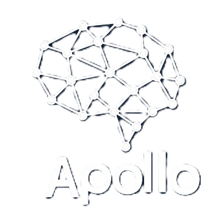

<div align="center">
  
  <h1>Apollo Landing Page</h1>
  <p>Decisiones científicas — IA y Ciencia de Datos al servicio de la industria.</p>
</div>

---

## Descripción

Landing page de **Apollo Innovation**, una empresa dedicada a fusionar la rigurosidad científica con la realidad industrial para optimizar la toma de decisiones mediante Inteligencia Artificial y Ciencia de Datos avanzada.

## Tech Stack

- **React 19** — UI library
- **TypeScript** — Type safety
- **Vite** — Build tool & dev server
- **Chakra UI v2** — Component library & styling
- **Framer Motion** — Animations
- **Lucide React** — Icons


## Requisitos Previos

- [Node.js](https://nodejs.org/) (v18+)
- npm o yarn

## Uso

```bash
# Desarrollo
npm run dev

# Build de producción
npm run build

# Preview del build
npm run preview

# Type checking
npm run lint
```

La app estará disponible en `http://localhost:3000`.


## Licencia

© 2026 Apollo Innovation. Todos los derechos reservados.
